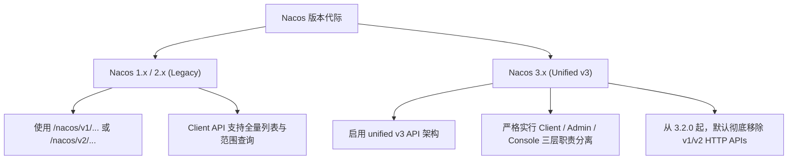

# ☸️ 远程 Nacos 操作、运维与安全防护核心参考指南

本指南对操作远程 Nacos（服务发现与配置中心）的日常运维经验、接口调用规范以及安全接入策略进行深度梳理与沉淀，旨在帮助开发者和 AI Agent 在跨网络环境管理 Nacos 时提供标准化的行动指引。

---

## ⚡ 一、 Nacos 核心版本差异分水岭

在处理 Nacos 操作时，首要任务是明确目标服务端的**大版本**，版本之间的 HTTP API 协议和内部通信机制有本质的不同：



### 🚨 3.2.x 版本升级避坑指南 (重要)
*   **Legacy API 默认移除**：从 **Nacos 3.2.0** 开始，原有的 `/nacos/v1/...` 和 `/nacos/v2/...` HTTP API **默认不再随服务端分发**。
*   **老旧客户端报错**：如果微服务使用的是较老的 Spring Cloud Nacos 客户端 SDK，直接连接 Nacos 3.2.x 服务端可能会因无法识别 v3 接口而发生注册失败（报 `404` 或 `500`）。
*   **临时过渡方案**：如果短时间内无法升级客户端 SDK，必须在 Nacos 3.2.x 服务端显式启用 `Nacos Legacy API Adapter`（遗留 API 适配器）模块以提供协议向下兼容。

---

## 📂 二、 Nacos v3 三层职责分离设计

Nacos 3.x 对 OpenAPI 按照使用场景进行了物理隔离，旨在防止低特权客户端接口的大流量查询拖垮集群：

1.  **Client API (`/v3/client/...`)**：仅面向普通微服务，设计原则是极致轻量、高并发。**不支持**任何范围查询、模糊查询或批量导出。
2.  **Admin API (`/v3/admin/...`)**：面向运维工具、网关和第三方管理系统。支持批量管理、全量查询、导出导入等特权级操作。**需要强身份校验**。
3.  **Console API (`/v3/console/...`)**：用于内置的 Web 控制台。

---

## 🧪 三、 常用脱敏 OpenAPI v3 端点速查 (cURL 示例)

以下所有 cURL 示例均经过**完全脱敏**处理，其中的敏感 IP、密码及命名空间 ID 均已被通用占位符替换，保障代码仓库的安全性。

### 1. 安全认证：获取 Access Token (Admin API)
在开启认证的 Nacos 集群中，几乎所有的特权操作都需要在 Header 或 Query 中携带 `accessToken`。
```bash
curl -X POST "http://<nacos-host>:<port>/nacos/v3/auth/user/login" \
  -H "Content-Type: application/x-www-form-urlencoded" \
  --data-urlencode "username=<username>" \
  --data-urlencode "password=<password>"
```
> 返回的 JSON 中包含 `"accessToken": "JWT_TOKEN_STRING..."`，有效期通常为 60 分钟。

### 2. 配置管理 (Config Management)
*   **获取配置内容 (Client 级别，精细化读取)**：
    ```bash
    curl -X GET "http://<nacos-host>:<port>/nacos/v3/client/cs/config?dataId=<data-id>&group=<group>&tenant=<namespace-id>&accessToken=<your-token>"
    ```
*   **发布/修改配置 (Admin 级别，特权操作)**：
    ```bash
    curl -X POST "http://<nacos-host>:<port>/nacos/v3/admin/cs/config" \
      -H "Content-Type: application/x-www-form-urlencoded" \
      --data-urlencode "dataId=<data-id>" \
      --data-urlencode "group=<group>" \
      --data-urlencode "tenant=<namespace-id>" \
      --data-urlencode "content=<config-content>" \
      --data-urlencode "type=yaml" \
      --data-urlencode "accessToken=<your-token>"
    ```

### 3. 服务发现 (Naming Service)
*   **注册服务实例 (Client 级别)**：
    ```bash
    curl -X POST "http://<nacos-host>:<port>/nacos/v3/client/ns/instance" \
      -H "Content-Type: application/json" \
      -d '{
        "ip": "<client-ip>",
        "port": 8080,
        "serviceName": "<service-name>",
        "groupName": "<group-name>",
        "namespaceId": "<namespace-id>"
      }'
    ```
*   **查询健康实例列表 (Client 级别)**：
    ```bash
    curl -X GET "http://<nacos-host>:<port>/nacos/v3/client/ns/instance/list?serviceName=<service-name>&namespaceId=<namespace-id>&accessToken=<your-token>"
    ```

---

## 🛡️ 四、 远程网段接入与安全防护最佳实践

当操作远程或跨网段的 Nacos 服务端时，必须牢记以下网络和安全准则：

### 1. ⚠️ gRPC 偏移端口开放要求（核心坑点）
Nacos 2.x/3.x 引入了高性能的 gRPC 双向通道进行心跳和服务同步。在进行防火墙或安全组配置时，**仅仅开放 8848 端口是绝对不够的**：
*   **主端口 (HTTP)**：`8848`（用于控制台及部分 OpenAPI 交互）。
*   **客户端 gRPC 端口 (主端口往上偏移 1000)**：`9848`（**必须双向开放**，微服务连接的核心通道！）。
*   **服务端 gRPC 端口 (主端口往上偏移 1001)**：`9849`（用于集群节点间同步，若跨集群同步或多网卡部署必须开放）。

### 2. 🔐 生产环境安全加固 Checklist
*   [ ] **禁止默认口令**：初始化安装后，务必通过控制台修改默认的管理员 `nacos/nacos` 密码，推荐使用高强度复杂口令。
*   [ ] **网络隔离**：千万不要将 Nacos 的 8848/9848 端口直接暴露在没有任何 ACL 策略的公网。推荐使用内网 VPC、VPN 隧道或反向代理网关接入。
*   [ ] **敏感路径封禁**：如果在公网暴露了 Nacos 控制台，建议在反向代理（如 Nginx）上封禁 `/v3/admin/...` 开头的运维接口路径，仅允许受信任的内网 IP 访问，实施精细化 API 防护。

---

## 📄 五、 Spring Cloud Nacos 本地 YAML 脱敏配置标准

当编写本地微服务配置文件时，参考以下完全脱敏的标准格式：

```yaml
spring:
  application:
    name: <your-application-name>
  cloud:
    nacos:
      config:
        server-addr: <nacos-remote-host>:<nacos-port>  # 远程 Nacos 服务地址 (推荐使用内网/VPN IP)
        file-extension: yaml
        namespace: <namespace-uuid>                    # 隔离的命名空间 ID (使用 UUID)
        group: <group-name>                            # 配置分组
        username: <auth-username>                      # 专门分配的只读或读写账号
        password: <auth-password-encrypted-or-strong>  # 强密码凭证
        import-check:
          enabled: false
      discovery:
        server-addr: <nacos-remote-host>:<nacos-port>
        namespace: <namespace-uuid>
        username: <auth-username>
        password: <auth-password-encrypted-or-strong>
```
